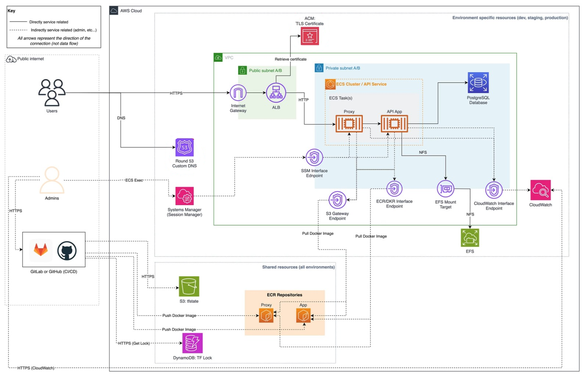
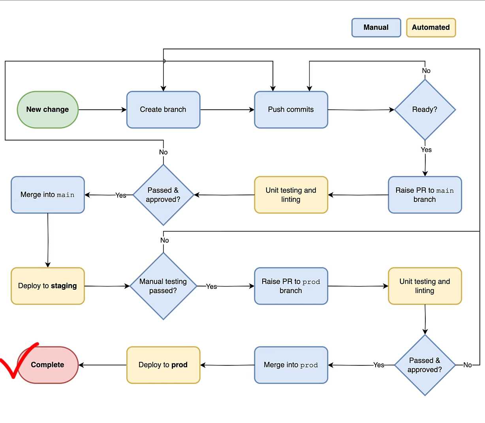

# AWS Deployment of Django REST API using Terraform and GitHub CI/CD

## Overview

This project demonstrates the deployment of a sample Django REST API to AWS using Terraform, GitHub, Docker, and a suite of AWS technologies. The setup is designed to deploy a Django application but can be adapted to any web application running in Docker.

## Architecture

The architecture leverages several AWS services to create a scalable, secure, and resilient infrastructure. Below is a high-level overview of the architecture:

### Git Workflow

The Git workflow for this project is designed to ensure code quality and facilitate smooth deployment processes. Here is an overview of the workflow:

1. **New Change**: A new change is initiated.
2. **Create Branch**: A new branch is created for the change.
3. **Push Commits**: Code changes are committed and pushed to the branch.
4. **Readiness Check**: Ensure the changes are ready for review.
    - If not ready, continue committing changes.
    - If ready, raise a Pull Request (PR) to the `main` branch.
5. **Unit Testing and Linting**: Automated unit tests and linting are run.
6. **Code Review and Approval**: The PR is reviewed and approved.
    - If not approved, make necessary changes and push commits.
    - If approved, merge into the `main` branch.
7. **Deploy to Staging**: The changes are deployed to the staging environment.
8. **Manual Testing**: Perform manual testing in the staging environment.
    - If manual testing fails, make necessary changes.
    - If manual testing passes, raise a PR to the `prod` branch.
9. **Deploy to Production**: The changes are deployed to the production environment.
10. **Completion**: The deployment is complete
### Workflow Overview

The deployment workflow involves several steps to ensure a smooth and automated process:

1. **Code Management**: The application's source code is managed in a GitHub repository. All changes to the codebase trigger automated workflows using GitHub Actions.
2. **Infrastructure as Code**: Terraform scripts define the AWS infrastructure, enabling easy creation, modification, and destruction of resources.
3. **Continuous Integration (CI)**: Upon code changes, GitHub Actions workflows are triggered to run tests, build Docker images, and push these images to AWS Elastic Container Registry (ECR).
4. **Continuous Deployment (CD)**: Post CI, Terraform is used to apply changes to the AWS infrastructure, deploying the updated Docker images to Elastic Container Service (ECS).
5. **Routing and Load Balancing**: AWS Route53 and Application Load Balancer (ALB) are used to route traffic and balance loads, ensuring high availability and scalability.
6. **Database and Storage**: The application uses AWS Relational Database Service (RDS) for database management and Elastic File System (EFS) for shared storage.
7. **Monitoring and Logging**: AWS CloudWatch is used for monitoring application performance and logging, providing insights into the application's health and performance.
8. **Security and Compliance**: AWS Identity and Access Management (IAM) and Certificate Manager (ACM) are used to manage access and secure the application with TLS/SSL certificates.

### Key AWS Services Used

- **Elastic Container Registry (ECR)**
- **Relational Database Service (RDS)**
- **Elastic Container Service (ECS)**
- **Application Load Balancer (ALB)**
- **Elastic File System (EFS)**
- **Virtual Private Cloud (VPC)**
- **Subnets**
- **Gateways**
- **Endpoints**
- **Simple Storage Service (S3)**
- **Route53**
- **Identity and Access Management (IAM)**
- **AWS Certificate Manager (ACM)**

## Learning Objectives

By working through this project, you will learn how to:

1. **Define Infrastructure as Code (IaC)**: Use Terraform to create and manage AWS resources, allowing you to easily create and destroy environments.
2. **Design a Robust Architecture**: Develop a scalable, secure, and resilient architecture that supports zero downtime deployments.
3. **Implement CI/CD Workflows**: Set up professional development workflows based on GitHub Actions to automate processes and speed up deployments.
4. **Manage AWS Accounts**: Properly administer an AWS account in accordance with best practices to mitigate risks and control costs.

